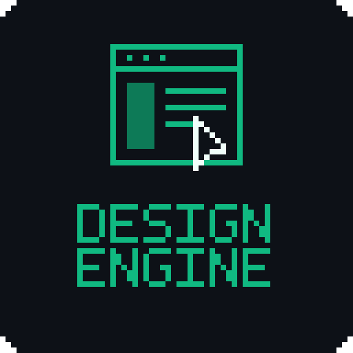

<div align="center">
  

# ▓▓ DESIGN ENGINE ▓▓

`[ vague idea :: adaptive interview :: design direction :: reusable prompt · DESIGN.md ]`

[](.claude-plugin/plugin.json)
[](https://agentskills.io)
[](LICENSE)

</div>
<br/>

```text
INTAKE → DECIDE → DIRECTION → PROMPT → BUILD NOTES
```

An Agent Skill that turns *"I need a ___ but don't know how it should
look"* into a concrete interface direction. It asks only for what's
missing — never a fixed questionnaire — and hands back a prompt you can
reuse in any generation or implementation tool.

<br/>

### ▸ install

```text
npx skills add jonaskahn/design-engine       # this project
npx skills add jonaskahn/design-engine -g -y # every project
```

Claude Code native marketplace:

```text
/plugin marketplace add jonaskahn/design-engine
/plugin install design-engine@design-engine
```

Either path installs [`skills/design-engine`](skills/design-engine/SKILL.md)
— or drop that folder into any skills directory by hand, no build step, no
dependencies.

<br/>

### ▸ usage

No command, no flags. Just describe what you're building.

> Help me design a landing page for a privacy-focused calendar app.
> Freelancers, main action is starting a trial, should feel calm not techy.

What happens next:

It keeps every fact already in your request, locks any existing design
it finds, routes to one experience type below (plus at most one
variant or the redesign overlay), and asks only the missing,
consequential decisions — grouped, a few per turn. An anti-slop check
runs before it hands back four sections in one response: Selected UI
Direction · Final Prompt · DESIGN.md · Build Notes. If you asked it to
*build* the thing, it keeps going and implements against the Final
Prompt.

Workflow and routing table:
[`skills/design-engine/SKILL.md`](skills/design-engine/SKILL.md)

<br/>

#### ▸ experience types — auto-routed, pick one

| type | for |
|---|---|
| `personal` | portfolios, resumes, personal sites |
| `marketing` | landing pages, product sites, conversion pages |
| `application-ui` | dashboards, admin panels, internal tools |
| `ecommerce` | storefronts, marketplaces, real estate, job boards, directories |
| `content-docs` | blogs, docs, knowledge bases, changelogs |
| `mobile-app` | native / hybrid app screens |
| `ai-chat` | chat, assistant, agent interfaces |
| `email-template` | campaign, newsletter, transactional email |

`redesign` isn't a type of its own — say *"redesign my ___"* and it
overlays onto whichever type above matches the surface.

#### ▸ variants — layered on a type, at most one

- `event-page`, `nonprofit-donation`, `booking` → on `marketing`
- `saas-onboarding` → on `application-ui` or `marketing`
- `community-social` → on `application-ui`

#### ▸ always asked vs. only when it matters

- **theme** (light / dark / both) — every intake
- **accessibility target**, **localization / RTL** — only when the
  request signals it (regulated, enterprise, EU, multi-language,
  non-Latin script); otherwise a stated default is assumed, no extra
  questions

<br/>

### ▸ existing design

Point the skill at a codebase, URL, screenshot, or brand guide and it
locks what's already there — palette, type, tokens, components — and
builds on top of it instead of inventing over it. Exact values are
reused; gaps become questions, never guesses.

### ▸ reference design languages

No existing design? It offers 2-3 named references tuned to the
experience type and audience — Apple, IBM Carbon, Airtable, Arc, BMW,
Stripe, Material 3, and more. Pick one and it researches the
latest official version before writing your prompt.

### ▸ anti-slop

Generic AI defaults (purple gradients, Inter-everywhere, cream +
terracotta, pill buttons, glass blur, "Elevate your workflow") are
banned by default. If you choose one deliberately, it keeps it and
notes it once in Build Notes. The output always includes a named
"Avoid" list so whatever builds it stays specific to your product.

<br/>

### ▸ what it won't do

- invent copy, prices, testimonials, metrics, or brand assets — missing
  ones stay labeled placeholders
- copy a reference brand's logo, trademark, or unlicensed proprietary
  typeface — inspiration only
- present generic AI-default styling unless you explicitly chose it
- send secrets, private URLs, or customer data into an external prompt
  without you saying so
- build unasked — a design-only request ends at the handoff (direction,
  prompt, DESIGN.md, build notes); implementation starts only when the
  request itself asked to build, and then it follows the handoff rather
  than replacing it

<br/>

### ▸ layout

```text
design-engine/
├── .claude-plugin/          plugin + marketplace manifests
└── skills/design-engine/
    ├── SKILL.md             entrypoint: workflow + routing
    └── references/          loaded on demand, one type at a time
        ├── existing-design.md    discover + lock an existing design
        ├── design-references.md  reference design index + research procedure
        ├── anti-slop.md          banned-by-default catalog + check
        ├── design-md-template.md DESIGN.md skeleton
        ├── shared-intake.md
        ├── output-contract.md    4 sections (incl. DESIGN.md)
        ├── <experience-type>.md  one per experience type
        ├── redesign.md
        ├── brands/               reference token files
        └── variants/
```
